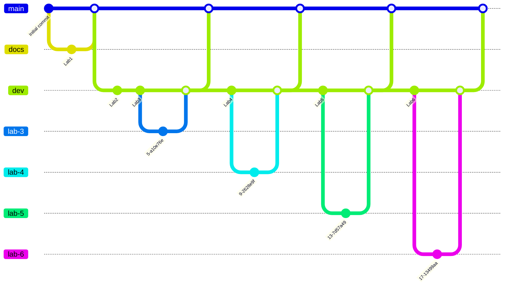
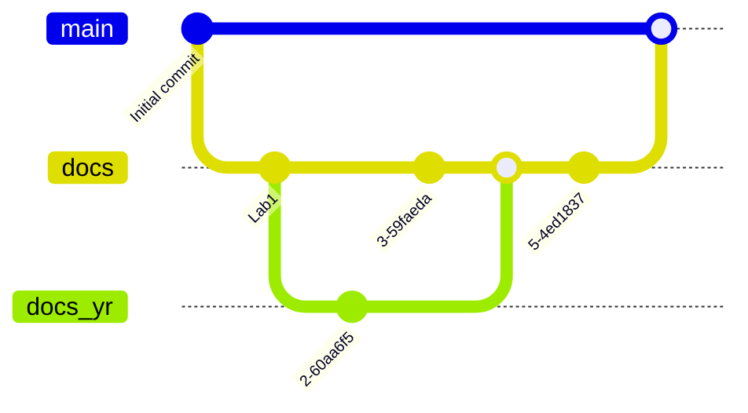
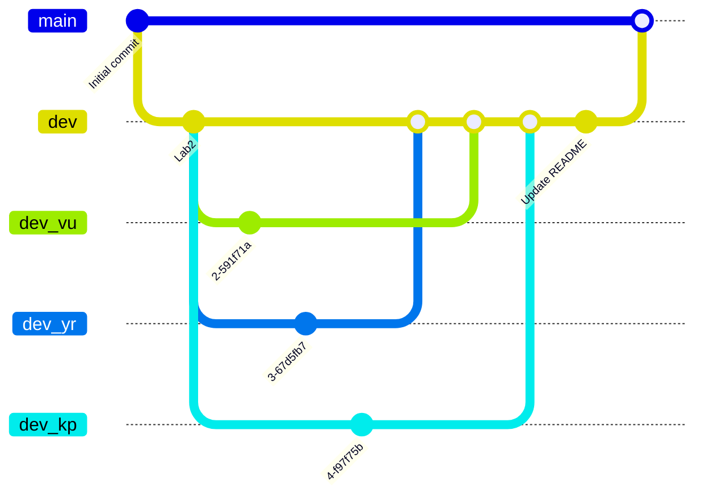
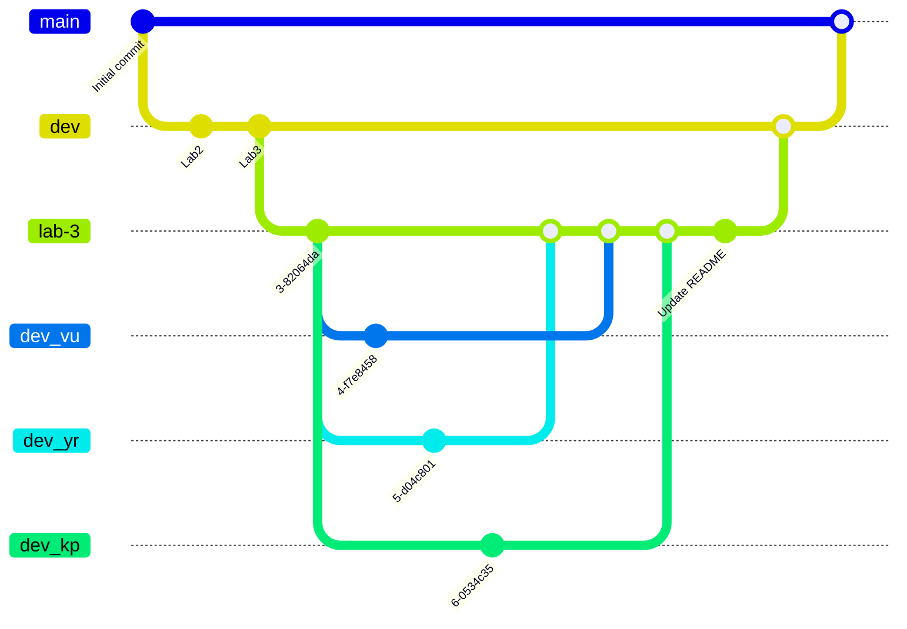

# Trackly-db-Course

**Дисципліна:** «Бази даних»  
**Заклад:** Національний технічний університет України «Київський політехнічний інститут імені Ігоря Сікорського»

## Таблиця лабораторних робіт

|  #  | Назва лабораторної роботи                   |     Посилання     |
| :-: | :------------------------------------------ | :---------------: |
|  1  | Збір вимог та розробка схеми ER             | [Lab1](./Lab1.md) |
|  2  | Перетворення ER-діаграми у схему PostgreSQL |        ---        |
|  3  | SQL OLTP - маніпулювання даними             |        ---        |
|  4  | SQL OLAP - аналітичні запити                |        ---        |
|  5  | Нормалізація баз даних                      |        ---        |
|  6  | Міграції схем (Prisma ORM)                  |        ---        |

## Модель розгалуження Git (Branching Strategy)

Використовується багаторівнева модель гілкування для організації командної роботи над лабораторними роботами

### Призначення основних гілок:

- `main` - стабільна версія проєкту із фінальними, перевіреними звітами та кодом
- `dev` - загальна гілка розробки, куди інтегруються готові завдання перед релізом у `main`
- `docs` / `lab-N` - гілки для конкретних лабораторних робіт або модулів документації
- `dev_*` (`dev_vu`, `dev_yr`, `dev_kp`) — персональні гілки

1. Загальний цикл лабораторних робіт

2. Детальна схема гілки docs (Lab1)

3. Детальна схема для Lab2

4. Робочий процес для лабораторних робіт починаючи з Lab3

Для кожного завдання створюється окрема ізольована гілка (lab-N). Персональні гілки учасників створюються вже від неї, зливаються в lab-N, і тільки після фінальної перевірки потрапляють у dev, а потім у main

**Автори**  
- [Уманець Вікторія](https://github.com/cyjiky)
- [Романов Єгор](https://github.com/yeghor)
- [Прокопцов Кірілл](https://github.com/X0nexed)

